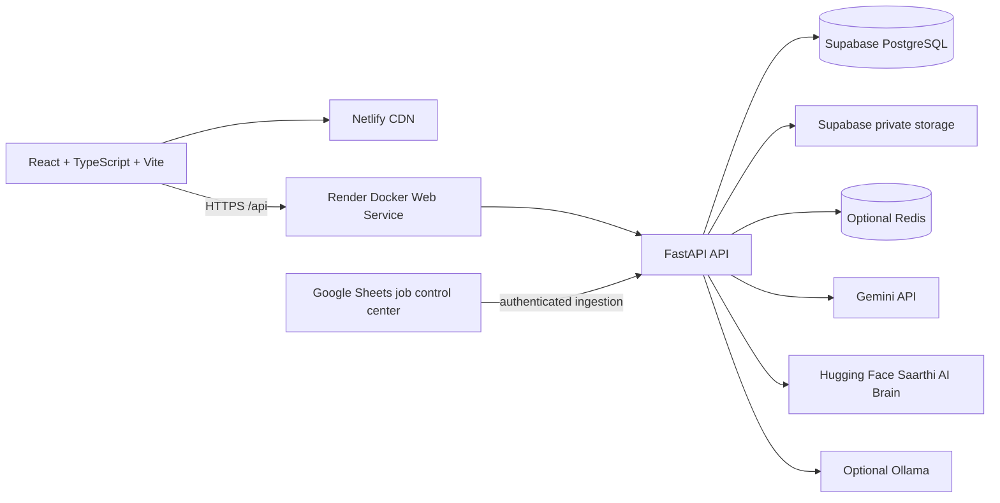

<div align="center">

# 🧭 Saarthi AI

### From career uncertainty to connected action.

Saarthi is an AI-powered **Career Operating System** that connects profile, resume,
skills, goals, jobs, learning, projects, interview preparation, and career progress
into one connected workflow — instead of scattering them across a dozen disconnected tools.

[](https://saarthi-link.netlify.app)
[](https://saarthilink.onrender.com/docs)
[](https://github.com/Balama2520/SaarthiLink)
[](https://huggingface.co/spaces/Balamaneesh2520/saarthi-ai-brain)
[](mailto:saarthi.ai.team@gmail.com)


</div>

---

## 👔 For Recruiters, Hiring Managers & Partners

**You don't need to read this whole README to reach us.**

If you're exploring:

- Hiring / recruitment opportunities
- Talent technology or AI-in-career-tech collaboration
- Engineering roles or contract work
- University or student program partnerships
- Research collaboration
- Product or SaaS/enterprise partnerships

Start here:

| | |
|---|---|
| 📧 **Contact** | [saarthi.ai.team@gmail.com](mailto:saarthi.ai.team@gmail.com) |
| 🚀 **Try the product** | [saarthi-link.netlify.app](https://saarthi-link.netlify.app) |
| 📚 **See the API** | [saarthilink.onrender.com/docs](https://saarthilink.onrender.com/docs) |
| 💻 **Read the code** | [github.com/Balama2520/SaarthiLink](https://github.com/Balama2520/SaarthiLink) |

This is a real, deployed, end-to-end system — not a mockup — built and maintained by a single founding engineer. The sections below walk through what it does, how it's built, and how to run it locally.

---

## 👤 Who is Saarthi for?

- **Students** trying to figure out what skills, roles, and projects actually matter for the career they want.
- **Early-career professionals** who need a single place to track goals, resumes, and job search progress.
- **Career switchers** navigating an unfamiliar field without a clear roadmap.
- **Researchers and graduate-track students** who need help planning coursework, certifications, and applications.

The goal is simple: help someone see where they stand, decide the next useful action, and turn that action into visible progress — with AI as a guide, not a black box.

---

## Why Saarthi?

Career development today is fragmented across resume builders, job boards, learning platforms, note-taking apps, interview-prep tools, and generic AI chat — none of which talk to each other. Saarthi's premise is that these are not separate problems; they're one connected decision:

```text
Profile → Resume → Skills → Goals → Jobs → Copilot
   → Roadmap → Learning → Projects → Interview → Progress
```

Saarthi keeps all of this in one place so recommendations, gaps, and next steps are grounded in the same data instead of scattered guesses.

> **Note:** AI output in Saarthi is decision support, not a promise of employment, salary, or admission. Users should verify important claims independently.

---

## 🧩 Product Features

| Area | What it does |
|---|---|
| **Career Dashboard** | Career health, profile completeness, daily missions, goals, and suggested next actions. |
| **Profile & Skills** | Structured education, preferences, target roles, links, and normalized technical skills. |
| **Resume Intelligence** | PDF/DOCX/TXT upload, extraction, version history, ATS analysis, skill-gap detection, profile sync. |
| **Job Discovery** | Searchable job listings, filters, recommendations, match reasoning, and saved jobs. |
| **Career Copilot** | Context-aware chat grounded in the user's own Saarthi data. |
| **Learning Roadmaps** | Role-specific skills, projects, milestones, and timelines. |
| **Goal Navigator** | Parent goals broken into milestones and tasks. |
| **Interview Coach** | Technical, behavioral, project-based, and resume-based interview preparation. |
| **Career Toolkit** | Company decoding, outreach help, salary guidance, opportunity strategy, resume keywords. |
| **Research & Graduate Hub** | Research workflows, experiments, higher-education and certification planning. |
| **Workspaces & Notes** | Persistent, structured AI work areas — not a single disconnected chat thread. |

---

## 🚀 Try Saarthi

**[saarthi-link.netlify.app](https://saarthi-link.netlify.app)**

Whether you're evaluating Saarthi as a user, recruiter, partner, researcher, or developer, the live product is the fastest way to understand the platform.

---

## 🏗️ System Architecture



### Responsibility boundaries

| Layer | Responsibility | Production location |
|---|---|---|
| Frontend | User experience, local state, authenticated API calls | Netlify |
| Backend | Authentication, authorization, business logic, AI orchestration, validation, persistence | Render Docker service |
| Database | Users, profiles, jobs, goals, sessions, roadmaps, audit data | Supabase PostgreSQL |
| File storage | Private resumes and user documents | Supabase Storage |
| AI Brain | Qwen-based inference and document-aware Gradio service | Hugging Face Space |
| Job operations | Controlled job ingestion and seeding configuration | Google Sheets + backend webhook |
| Cache | Optional rate/cache/memory acceleration | Redis-compatible service |

The browser never receives private AI tokens, database credentials, service-role keys, or privileged business logic. **The backend is the security boundary.**

---

## 🧠 AI Architecture

The backend controls all AI access — the frontend never talks to a model provider directly. The active gateway lives at `backend/app/ai/gateway.py` and tries providers in order:

1. **Hugging Face Saarthi AI Brain** — when `HF_SPACE_ID` is configured. Currently running `Qwen/Qwen2.5-3B-Instruct` as a document-aware Gradio service.
   [huggingface.co/spaces/Balamaneesh2520/saarthi-ai-brain](https://huggingface.co/spaces/Balamaneesh2520/saarthi-ai-brain)
2. **Gemini** — when `GEMINI_API_KEY` is configured.
3. **Ollama** — optional local fallback for development.

Provider credentials are loaded only by the backend.

**AI is not autonomous and does not guarantee career outcomes.** Its output is decision support, and users should verify important information before acting on it.

---

## 💼 Job Platform

Jobs are ingested and maintained through a controlled Google Sheets workflow (see below) and served through the backend's job discovery API. Experience level, location, role, and skills are job metadata used for filtering and match reasoning — the platform is not limited to any single experience band, and personalized matching can draw on a user's skills, education, location, goals, and preferences as those signals are available.

### Job Seeding Control Center

Job ingestion is controlled through a 14-tab Google Sheets workflow:

```text
01_SOURCES       02_COMPANIES       03_ROLE_RULES       04_LOCATION_RULES
05_SKILLS        06_INCLUDE_RULES   07_EXCLUDE_RULES   08_SEED_CONFIG
09_JOBS_STAGING  10_SEED_RUNS       11_SYNC_LOGS       12_SOURCE_ERRORS
13_DASHBOARD     14_API_CONFIG
```

The backend webhook validates payloads, authenticates with `X-Saarthi-Ingest-Token`, deduplicates by company/title/location, and applies hard pagination and batch-size limits. The service-account JSON and webhook token are kept in managed secrets only.

---

## 🛠️ Technology Stack

### Frontend
- React 19, TypeScript, Vite 8
- Zustand for client state and persistence
- TanStack Query for selected server-state workflows
- Tailwind CSS, Framer Motion, Lucide icons, Recharts
- Netlify SPA redirects and API proxy configuration

### Backend
- Python 3.11 runtime in production
- FastAPI, Uvicorn, Pydantic Settings, SQLAlchemy 2, Alembic
- JWT authentication, bcrypt password hashing, refresh-token rotation
- SlowAPI rate limiting, request IDs, CORS controls, security headers
- ChromaDB and sentence-transformers for retrieval features
- PDF, DOCX, and TXT extraction for resume workflows

### Data & Infrastructure
- Supabase PostgreSQL (primary database)
- Supabase Storage (private resume/document storage)
- Optional Redis-compatible cache
- Render (backend hosting), Netlify (frontend hosting)

### AI
- Hugging Face Space (Qwen-based inference)
- Gemini API
- Optional Ollama (local development fallback)

### Job Ingestion
- Google Sheets (control center)
- Authenticated backend webhook ingestion

---

## 🔒 Security

- Authorization and business rules live in the backend — never trust the client.
- Every user-owned query is scoped by the authenticated user ID.
- Personal writes and protected resources require authentication.
- AI provider tokens, database credentials, and service-role keys are server-side only.
- Supabase Storage buckets are private.
- CORS uses exact production origins — never `*`.
- Rate limiting via SlowAPI, plus request IDs and security headers.
- Secrets are never committed — `.env` files, resumes, database exports, Chroma data, and logs are excluded from version control.
- Any credential that leaks into a commit, transcript, screenshot, or issue is rotated immediately.

Saarthi has **not** undergone a formal third-party security audit or certification, and none is claimed here.

---

## 📚 API

- **Production API:** [saarthilink.onrender.com](https://saarthilink.onrender.com)
- **Interactive docs (Swagger):** [saarthilink.onrender.com/docs](https://saarthilink.onrender.com/docs)
- **Health check:** `GET /api/health`

Grouped route areas under `/api` include:

```text
/api/auth        /api/profile     /api/resume      /api/jobs
/api/goals       /api/roadmap     /api/career      /api/interview
/api/sessions    /api/workspaces  /api/notes       /api/projects
/api/research    /api/gradhub     /api/admin       /api/health
```

Protected endpoints require authentication. When `DEBUG=true`, FastAPI exposes `/docs` and `/redoc`; these are kept disabled or protected in production per deployment policy.

---

## 💻 Developer Quick Start

### Prerequisites
- Git
- Python 3.11 (recommended)
- Node.js 18+
- PostgreSQL for production-like local work, or SQLite for lightweight development
- Optional: Ollama for local model inference

### Clone and configure

```bash
git clone https://github.com/Balama2520/SaarthiLink.git
cd SaarthiLink
```

Create local environment files from the templates. **Never commit `.env` files.**

```powershell
copy .env.example .env                 # Windows
copy backend\.env.example backend\.env
```

For a minimal local setup: configure a strong `SECRET_KEY`, an explicit local `ALLOWED_ORIGINS`, and a local SQLite `DATABASE_URL`. Configure Gemini, HF, or Ollama only for the AI provider you intend to exercise.

### Backend

```powershell
cd backend
python -m venv .venv
.\.venv\Scripts\Activate.ps1
python -m pip install --upgrade pip
pip install -r requirements.txt
alembic upgrade head
uvicorn app.main:app --host 0.0.0.0 --port 2520 --reload
```

On macOS/Linux, activate with `source .venv/bin/activate`.

### Frontend

```bash
cd frontend
npm ci
npm run dev
```

Runs at `http://localhost:5173` by default.

### Full local stack (Docker Compose)

```bash
docker compose up --build
```

Do not use sample database passwords or development secrets in a public or production environment.

---

## ⚙️ Configuration

Canonical template: [`backend/.env.example`](backend/.env.example)

| Variable | Purpose | Required |
|---|---|---|
| `SECRET_KEY` | Application signing and security | Yes |
| `ALLOWED_ORIGINS` | Exact frontend origins, comma-separated | Yes |
| `DATABASE_URL` | PostgreSQL connection string | Yes |
| `GEMINI_API_KEY` | Gemini backend credential | Optional provider |
| `HF_SPACE_ID` | Hugging Face Space, e.g. `Balamaneesh2520/saarthi-ai-brain` | Optional provider |
| `HF_API_TOKEN` | Private HF Space access token | Optional provider |
| `SUPABASE_URL` | Supabase project URL | Storage/DB integration |
| `SUPABASE_SERVICE_ROLE_KEY` | Private backend storage access | Storage integration |
| `REDIS_URL` | Optional Redis connection | Optional |
| `ADMIN_USERNAMES` | Comma-separated admin allowlist | Admin workflows |
| `INGEST_WEBHOOK_TOKEN` | Job ingestion webhook credential | Job ingestion |

Store real values in Render, GitHub Actions, Netlify, Supabase, or Hugging Face Space secrets — never in source code, frontend bundles, screenshots, issues, or this README.

---

## 🚢 Production Deployment

Production branch: **`master`**

```text
GitHub (master)
  → Render: backend/Dockerfile → FastAPI + Uvicorn
  → Netlify: frontend/ via netlify.toml → static SPA
```

**GitHub** is the source of truth for code, migrations, tests, and deployment config — it is not a database, secret manager, resume store, or vector store.

**Render** runs `backend/render.yaml` against `backend/Dockerfile`:

```text
alembic upgrade head
uvicorn app.main:app --host 0.0.0.0 --port $PORT
```

Health endpoint: `GET /api/health`. Free-tier instances may spin down after inactivity, so the first request after idle time can be slow.

**Netlify** builds the frontend with:

```bash
npm ci && npm run build
```

Publish directory: `frontend/dist`. `netlify.toml` provides SPA fallback routing and proxies `/api/*` to the Render backend.

**Database & storage:** Alembic migrations run against production PostgreSQL; Supabase Storage buckets stay private; storage references (not files) live in the database; PostgreSQL and user files are backed up independently; Redis and Chroma are treated as runtime infrastructure, not source-controlled data.

---

## 📁 Repository Structure

```text
.
├── backend/
│   ├── app/
│   │   ├── ai/              # AI gateway, routing, providers, prompts
│   │   ├── api/             # Main API routers
│   │   ├── core/            # Settings, security, cache, logging
│   │   ├── database/        # SQLAlchemy connection and sessions
│   │   ├── engine/          # Resume and background processing
│   │   ├── models/          # ORM models
│   │   ├── repositories/    # Persistence boundaries
│   │   ├── services/        # Product and domain services
│   │   └── rag/             # Retrieval features
│   ├── alembic/             # Database migrations
│   ├── tests/               # Backend tests
│   ├── Dockerfile           # Render production image
│   └── requirements.txt
├── frontend/
│   ├── src/                 # React application
│   ├── public/              # Static assets and verification files
│   └── package.json
├── .github/workflows/       # CI and keep-alive automation
├── render.yaml              # Render service blueprint
├── netlify.toml             # Netlify build, proxy, and SPA rules
├── docker-compose.yml       # Local full-stack environment
└── docs/                    # Architecture, operations, and audit records
```

---

## ✅ Verification / Testing

Frontend:

```bash
cd frontend
npm run build
npm run lint
```

Backend (from a Python 3.11 environment):

```bash
cd backend
pytest -q
```

The Hugging Face provider uses deterministic mocked tests and should never require a live HF token in ordinary CI. Live provider checks belong in an explicitly marked smoke-test workflow, separate from the default regression gate. The production Docker image uses Python 3.11 — local environments should match this when validating ChromaDB and the full backend suite.

---

## 🗺️ Roadmap

**Current**
Core career platform · Resume intelligence · Jobs · Goals · AI assistance · Learning · Interview preparation · Career tracking

**Next**
More intelligent matching · Deeper personalization · Improved AI career memory · Expanded job intelligence · Additional integrations

**Future (not yet built)**
Talent verification · Recruiter workflows · Enterprise capabilities · Advanced semantic matching · Partner integrations

---

## 🤝 Partnerships & Collaboration

For recruiters, companies, universities, research teams, EdTech partners, developers, or AI collaborators interested in working with Saarthi:

📧 [saarthi.ai.team@gmail.com](mailto:saarthi.ai.team@gmail.com)
🚀 [saarthi-link.netlify.app](https://saarthi-link.netlify.app)

---

## 🧑‍💻 Founder & Developer

**Bala Maneesh Ayanala**
Founder & Developer — Saarthi AI

Saarthi is an independent engineering and product project focused on connecting AI, career intelligence, learning, jobs, and action into a single system.

📧 [saarthi.ai.team@gmail.com](mailto:saarthi.ai.team@gmail.com)
💻 [github.com/Balama2520/SaarthiLink](https://github.com/Balama2520/SaarthiLink)

---

## ⚖️ Engineering Principles

1. **Product coherence** — every AI feature connects to the user's career state.
2. **Facts before inference** — stored facts, computed matches, and AI suggestions are kept distinct.
3. **Backend ownership** — authorization and business rules live in the backend.
4. **Bounded AI** — timeouts, provider fallback, structured outputs, and graceful degradation are mandatory.
5. **Migration discipline** — Alembic is the production schema authority.
6. **Observable operations** — request IDs, structured logs, health checks, and deployment records.
7. **Privacy by default** — minimize, isolate, and delete user data per policy.
8. **Honest product language** — never promise hiring, admission, salary, or model certainty.

---

## ⚠️ Disclaimer

Saarthi provides AI-assisted career information and decision support. **It does not guarantee employment, interviews, salary, admission, or placement.** Users should verify important information with employers, institutions, or official sources before acting on it.

---

## 🧾 License

**Licensing terms have not yet been formally committed to this repository.** No `LICENSE` file currently exists, so no license — including MIT — should be assumed. A `LICENSE` file will be added before this project is presented as open source or before external contributions are accepted.

---

## 🙌 Contributing

1. Create a focused branch from `master`.
2. Make the smallest coherent change.
3. Add or update tests for behavior changes.
4. Run the frontend build/lint and relevant backend tests.
5. Confirm no secrets or runtime data are staged.
6. Open a pull request describing the problem, solution, risks, and verification results.

Do not force-push `master`. Production changes should be traceable to a reviewed commit with a rollback path.

---

## 📖 Further Documentation

- [`docs/ARCHITECTURE.md`](docs/ARCHITECTURE.md) — system structure and boundaries
- [`docs/API.md`](docs/API.md) — API reference
- [`docs/DATABASE.md`](docs/DATABASE.md) — data model and migrations
- [`docs/AI_SYSTEM.md`](docs/AI_SYSTEM.md) — AI architecture and provider behavior
- [`docs/DEPLOYMENT.md`](docs/DEPLOYMENT.md) — operations and deployment guidance
- [`docs/CONTRIBUTING.md`](docs/CONTRIBUTING.md) — collaboration conventions

<div align="center">

**Saarthi AI — from career uncertainty to connected action.**

[Live Product](https://saarthi-link.netlify.app) · [API Docs](https://saarthilink.onrender.com/docs) · [GitHub](https://github.com/Balama2520/SaarthiLink) · [AI Brain](https://huggingface.co/spaces/Balamaneesh2520/saarthi-ai-brain) · [Contact](mailto:saarthi.ai.team@gmail.com)

</div>
