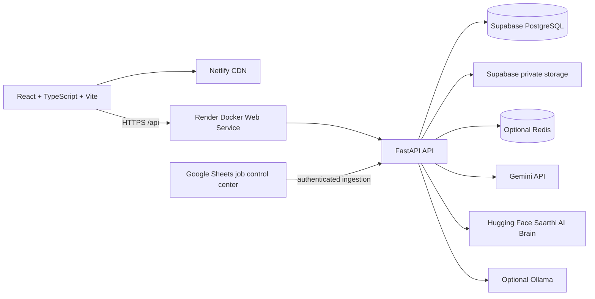

<div align="center">

# Saarthi AI

**Guiding intelligence. Connected action.**

Saarthi is an AI Career Operating System that turns a candidate's profile, resume,
skills, goals, jobs, learning plan, projects, and interview preparation into one
connected career workflow.

[Product](https://saarthi-link.netlify.app) | [Backend](https://saarthilink.onrender.com) | [Repository](https://github.com/Balama2520/SaarthiLink)


</div>

## Why Saarthi Exists

Most career tools answer isolated questions. Saarthi is designed around the
connected decisions behind a career:

```text
Profile -> Resume -> Skills -> Goals -> Jobs -> Copilot
    -> Roadmap -> Learning -> Projects -> Interview -> Progress
```

The platform is built for students, early-career professionals, researchers,
and people changing direction. It helps users understand where they are, choose
the next high-value action, and turn that action into measurable progress.

## Product Surface

- **Career dashboard**: career health, profile completeness, daily missions, goals, and next actions.
- **Profile and skills**: structured education, preferences, target roles, links, and normalized technical skills.
- **Resume intelligence**: PDF, DOCX, and TXT upload, extraction, version history, ATS analysis, skill gaps, and profile sync.
- **Job discovery**: searchable jobs, filters, recommendations, match reasoning, and saved jobs.
- **Career Copilot**: context-aware chat grounded in the user's available Saarthi data.
- **Learning roadmaps**: role-specific skills, projects, milestones, and timelines.
- **Goal Navigator**: parent goals with milestone and task hierarchies.
- **Interview Coach**: technical, behavioral, project, and resume-based preparation.
- **Career Toolkit**: company decoding, outreach, salary guidance, opportunity strategy, and resume keywords.
- **Research and Graduate Hub**: research workflows, experiments, higher education, certifications, and placement planning.
- **Workspaces and notes**: persistent, structured AI work areas instead of one disconnected chat thread.

AI output is treated as decision support, not a promise of employment, salary, or
admission. Users should verify important claims and recommendations.

## System Architecture



### Responsibility boundaries

| Layer | Responsibility | Production location |
| --- | --- | --- |
| Frontend | User experience, local state, authenticated API calls | Netlify |
| Backend | Authentication, authorization, business logic, AI orchestration, validation, persistence | Render Docker service |
| Database | Users, profiles, jobs, goals, sessions, roadmaps, audit data | Supabase PostgreSQL |
| File storage | Private resumes and user documents | Supabase Storage |
| AI Brain | Qwen-based inference and document-aware Gradio service | Hugging Face Space |
| Job operations | Controlled job ingestion and seeding configuration | Google Sheets + backend webhook |
| Cache | Optional rate/cache/memory acceleration | Redis-compatible service |

The browser never receives private AI tokens, database credentials, service-role
keys, or privileged business logic. The backend is the security boundary.

## Technology Stack

### Frontend

- React 19, TypeScript, Vite 8
- Zustand for client state and persistence
- TanStack Query for selected server-state workflows
- Tailwind CSS, Framer Motion, Lucide icons, Recharts
- Netlify SPA redirects and API proxy configuration

### Backend

- Python 3.11 runtime in production
- FastAPI, Uvicorn, Pydantic Settings, SQLAlchemy 2, Alembic
- JWT authentication, bcrypt password hashing, refresh-token rotation
- SlowAPI rate limiting, request IDs, CORS controls, security headers
- ChromaDB and sentence-transformers for retrieval features
- PDF, DOCX, and TXT extraction for resume workflows

### AI providers

The active gateway is `backend/app/ai/gateway.py`.

1. Hugging Face Saarthi AI Brain when `HF_SPACE_ID` is configured.
2. Gemini when `GEMINI_API_KEY` is configured.
3. Ollama as an optional local fallback.

Provider credentials are loaded only by the backend. The Hugging Face Space is a
separate service containing the Qwen model and its own Gradio application.

## Repository Layout

```text
.
├── backend/
│   ├── app/
│   │   ├── ai/              # AI gateway, routing, providers, prompts
│   │   ├── api/             # Main API routers
│   │   ├── core/            # Settings, security, cache, logging
│   │   ├── database/        # SQLAlchemy connection and sessions
│   │   ├── engine/          # Resume and background processing
│   │   ├── models/          # ORM models
│   │   ├── repositories/    # Persistence boundaries
│   │   ├── services/        # Product and domain services
│   │   └── rag/             # Retrieval features
│   ├── alembic/             # Database migrations
│   ├── tests/               # Backend tests
│   ├── Dockerfile           # Render production image
│   └── requirements.txt
├── frontend/
│   ├── src/                 # React application
│   ├── public/              # Static assets and verification files
│   └── package.json
├── .github/workflows/       # CI and keep-alive automation
├── render.yaml              # Render service blueprint
├── netlify.toml             # Netlify build, proxy, and SPA rules
├── docker-compose.yml       # Local full-stack environment
└── docs/                    # Architecture, operations, and audit records
```

## Local Development

### Prerequisites

- Git
- Python 3.11 recommended
- Node.js 18 or newer
- PostgreSQL for production-like local work, or SQLite for lightweight development
- Optional: Ollama for local model inference

### Clone and configure

```bash
git clone https://github.com/Balama2520/SaarthiLink.git
cd SaarthiLink
```

Create a local environment file from the templates. Never commit `.env` files.

```powershell
copy .env.example .env                 # Windows
copy backend\.env.example backend\.env
```

For a minimal local setup, configure a strong `SECRET_KEY`, an explicit local
`ALLOWED_ORIGINS`, and a local SQLite `DATABASE_URL`. Configure Gemini, HF, or
Ollama only for the AI provider you intend to exercise.

### Backend

```powershell
cd backend
python -m venv .venv
.\.venv\Scripts\Activate.ps1
python -m pip install --upgrade pip
pip install -r requirements.txt
alembic upgrade head
uvicorn app.main:app --host 0.0.0.0 --port 2520 --reload
```

On macOS or Linux, activate with `source .venv/bin/activate`.

### Frontend

```bash
cd frontend
npm ci
npm run dev
```

The development frontend normally runs at `http://localhost:5173`.

### Full local stack

Docker Compose starts the backend, frontend, PostgreSQL, and Redis services:

```bash
docker compose up --build
```

Do not use the sample database password or development secrets in a public or
production environment.

## Configuration

The canonical backend template is [backend/.env.example](backend/.env.example).
Important production variables include:

| Variable | Purpose | Required |
| --- | --- | --- |
| `SECRET_KEY` | Application signing and security | Yes |
| `ALLOWED_ORIGINS` | Exact frontend origins, comma-separated | Yes |
| `DATABASE_URL` | PostgreSQL connection string | Yes |
| `GEMINI_API_KEY` | Gemini backend credential | Optional provider |
| `HF_SPACE_ID` | Hugging Face Space, e.g. `Balamaneesh2520/saarthi-ai-brain` | Optional provider |
| `HF_API_TOKEN` | Private HF Space access token | Optional provider |
| `SUPABASE_URL` | Supabase project URL | Storage/DB integration |
| `SUPABASE_SERVICE_ROLE_KEY` | Private backend storage access | Storage integration |
| `REDIS_URL` | Optional Redis connection | Optional |
| `ADMIN_USERNAMES` | Comma-separated admin allowlist | Admin workflows |
| `INGEST_WEBHOOK_TOKEN` | Job ingestion webhook credential | Job ingestion |

Store secrets in Render environment variables, GitHub Actions secrets, Netlify
environment variables, Supabase settings, or Hugging Face Space secrets. Never
place them in source code, frontend bundles, screenshots, issues, or README files.

## Production Deployment

The production branch is `master`.

### GitHub

GitHub is the source of truth for source code, migrations, tests, documentation,
and deployment configuration. It is not a database, secret manager, resume store,
or vector store.

```text
GitHub master
  -> Render: backend/Dockerfile
  -> Netlify: frontend/ via netlify.toml
```

### Render

The service is defined in `render.yaml` and uses `backend/Dockerfile`:

```text
alembic upgrade head
uvicorn app.main:app --host 0.0.0.0 --port $PORT
```

Configure the secrets listed above in the Render dashboard. The health endpoint
is `GET /api/health`. Render may spin down a free instance after inactivity;
the first request after sleep can be slow.

### Netlify

Netlify builds the frontend with:

```bash
npm ci && npm run build
```

The publish directory is `frontend/dist`. `netlify.toml` provides SPA fallback
routing and proxies `/api/*` to the Render backend.

### Database and storage

- Run Alembic migrations against the production PostgreSQL database.
- Keep Supabase Storage buckets private.
- Store opaque storage references in the database, not user files in Git.
- Back up PostgreSQL and user files independently.
- Treat Redis and Chroma as runtime infrastructure, not source-controlled data.

## Job Seeding Control Center

The job ingestion system is controlled through a 14-tab Google Sheets workflow:

```text
01_SOURCES       02_COMPANIES       03_ROLE_RULES       04_LOCATION_RULES
05_SKILLS        06_INCLUDE_RULES   07_EXCLUDE_RULES   08_SEED_CONFIG
09_JOBS_STAGING  10_SEED_RUNS       11_SYNC_LOGS       12_SOURCE_ERRORS
13_DASHBOARD     14_API_CONFIG
```

The backend webhook validates payloads, authenticates with
`X-Saarthi-Ingest-Token`, deduplicates by company/title/location, and applies
hard pagination and batch-size limits. Keep the service-account JSON and webhook
token in managed secrets only.

## Security Rules

- Never commit `.env`, API keys, JWT secrets, service-role keys, private tokens, or credentials.
- Never commit resumes, user documents, database exports, Chroma databases, or logs.
- Keep HF, Gemini, Supabase, and Google credentials server-side.
- Use exact CORS origins in production; never use `*`.
- Scope every user-owned query by the authenticated user ID.
- Require authentication for personal writes and protected resources.
- Rotate any credential that appears in a commit, terminal transcript, screenshot, or issue.
- Use GitHub push protection and review secret-scanning alerts before merging.

## Verification

Run the frontend checks:

```bash
cd frontend
npm run build
npm run lint
```

Run the backend checks from the repository's supported Python environment:

```bash
cd backend
pytest -q
```

The Hugging Face provider has deterministic mocked tests and should never require
a live HF token during ordinary CI. Live provider checks belong in an explicitly
marked smoke-test workflow and must not be part of the default regression gate.

The production Docker image uses Python 3.11. Local environments should use the
same major/minor version when validating ChromaDB and the full backend suite.

## API Orientation

The backend exposes grouped routes under `/api`, including:

```text
/api/auth
/api/profile
/api/resume
/api/jobs
/api/goals
/api/roadmap
/api/career
/api/interview
/api/sessions
/api/workspaces
/api/notes
/api/projects
/api/research
/api/gradhub
/api/admin
/api/health
```

When `DEBUG=true`, FastAPI exposes interactive documentation at `/docs` and
`/redoc`. Keep those endpoints disabled or protected in production according to
the deployment policy.

## Engineering Principles

1. **Product coherence**: every AI feature should connect to the user's career state.
2. **Facts before inference**: distinguish stored facts, computed matches, and AI suggestions.
3. **Backend ownership**: authorization and business rules belong in the backend.
4. **Bounded AI**: timeouts, provider fallback, structured outputs, and graceful degradation are mandatory.
5. **Migration discipline**: Alembic is the production schema authority.
6. **Observable operations**: use request IDs, structured logs, health checks, and deployment records.
7. **Privacy by default**: minimize, isolate, and delete user data according to policy.
8. **Honest product language**: never promise hiring, admission, salary, or model certainty.

## Contributing

1. Create a focused branch from `master`.
2. Make the smallest coherent change.
3. Add or update tests for behavior changes.
4. Run frontend build/lint and relevant backend tests.
5. Confirm no secrets or runtime data are staged.
6. Open a pull request with the problem, solution, risks, and verification results.

Do not force-push `master`. Production changes should be traceable to a reviewed
commit and have a rollback path.

## Documentation

Deeper system material is available in `docs/`:

- `docs/ARCHITECTURE.md` - system structure and boundaries
- `docs/API.md` - API reference
- `docs/DATABASE.md` - data model and migrations
- `docs/AI_SYSTEM.md` - AI architecture and provider behavior
- `docs/DEPLOYMENT.md` - operations and deployment guidance
- `docs/CONTRIBUTING.md` - collaboration conventions

## Founder

Saarthi AI is founded and developed by **Bala Maneesh Ayanala**.

For product or partnership enquiries: `saarthi.ai.team@gmail.com`

## License

Licensing terms have not yet been committed to this repository. Add a `LICENSE`
file before presenting the project as open source or accepting external contributions.

<div align="center">

**Saarthi AI - from career uncertainty to connected action.**

</div>
