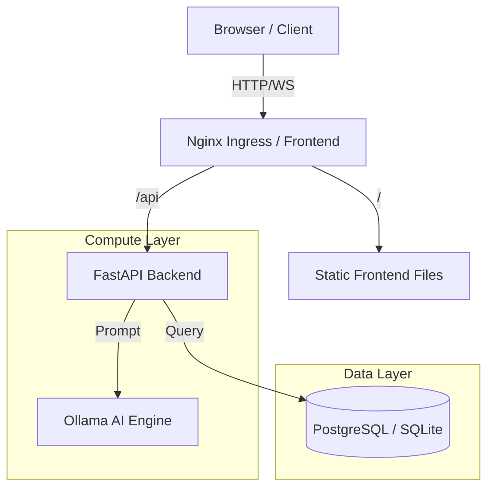

# System Architecture

## Overview
Saarthi AI uses a microservices-inspired architecture designed for scalability and containerization.

## Components
1. **Frontend**: Static SPA (Single Page Application) served via Nginx.
2. **Backend**: FastAPI (Python) service handling business logic, auth, and database interactions.
3. **Database**: SQLite (Dev) / PostgreSQL (Prod).
4. **AI Engine**: Ollama running locally or as a sidecar.

## System Diagram

