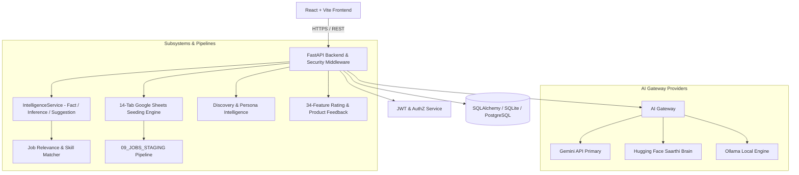

# System Architecture — Saarthi AI

**Tagline**: Guiding Intelligence • Connected Action  

---

## 1. High-Level Architecture Overview

Saarthi AI connects candidates, companies, recruiters, and educational institutions in a unified career intelligence system.

```mermaid
graph TD
    Client[React + Vite Frontend] -->|HTTPS / REST| Gateway[FastAPI Backend & Security Middleware]
    Gateway --> Auth[JWT & AuthZ Service]
    Gateway --> Intelligence[IntelligenceService - Fact / Inference / Suggestion]
    Gateway --> AIGateway[AI Gateway]
    Gateway --> SheetsEngine[14-Tab Google Sheets Seeding Engine]
    Gateway --> DB[(SQLAlchemy / SQLite / PostgreSQL)]

    subgraph AI Gateway Providers
        AIGateway --> Gemini[Gemini API Primary]
        AIGateway --> HF[Hugging Face Saarthi Brain]
        AIGateway --> Ollama[Ollama Local Engine]
    end

    subgraph Subsystems & Pipelines
        Intelligence --> Matching[Job Relevance & Skill Matcher]
        SheetsEngine --> Staging[09_JOBS_STAGING Pipeline]
        Gateway --> Discovery[Discovery & Persona Intelligence]
        Gateway --> Feedback[34-Feature Rating & Product Feedback]
    end
```

---

## 2. Key Architectural Layers

1. **Frontend**: React + TypeScript + Vite Single Page Application using Tailwind CSS and Framer Motion.
2. **Backend**: FastAPI with async request tracing, rate limiting middleware, Alembic migration engine, and SQLite/PostgreSQL support.
3. **AI Gateway**: Dynamic router selecting Gemini as primary cloud LLM provider, with Hugging Face Saarthi Brain integration and local Ollama execution capabilities.
4. **Google Sheets Control Center**: 14-tab canonical data seeding pipeline with HTTP retry logic (200, 400, 401/403, 409, 429, 50x) and dry-run safety enforcement.
5. **Data Layer**: SQLAlchemy 2.x ORM models supporting users, profiles, jobs, signals, discovery, feedback, contact requests, and audit logs.
