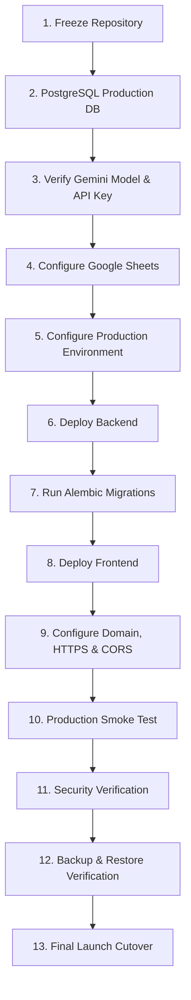

# Deployment & Reliability Guide — Saarthi AI

**Tagline**: Guiding Intelligence • Connected Action  
**Lead Developer**: Bala Maneesh Ayanala (`saarthi.ai.team@gmail.com`)  

---

## 1. Production Launch Workflow (13-Step Sequence)



### Detailed 13-Step Execution Protocol

1. **Freeze Repository**
   - Tag release baseline: `git tag -a v1.0.0 -m "Saarthi AI v1.0.0 Production Release"`
   - Ensure all 190 backend unit tests and 26 candidate E2E tests pass.

2. **PostgreSQL Production Database**
   - Provision managed PostgreSQL instance (e.g. AWS RDS / Supabase / Self-hosted PostgreSQL 15+).
   - Set `DATABASE_URL=postgresql://saarthi_user:<SECURE_PASSWORD>@db.saarthi.internal:5432/saarthi_prod`.

3. **Verify Gemini Model + API Key**
   - Obtain valid Google Gemini API Key starting with `AIzaSy...`.
   - Set `GEMINI_API_KEY=<AIzaSy...>` and `GEMINI_MODEL=gemini-2.5-flash` or `gemini-1.5-flash`.
   - Run live health check via `/api/health` or `gemini_smoke_test.py`.

4. **Configure Google Sheets Job Seeding Engine**
   - Provision Google Cloud Service Account and download key JSON.
   - Set `GOOGLE_SHEETS_SPREADSHEET_ID=<spreadsheet_id>` and `GOOGLE_SERVICE_ACCOUNT_JSON=<raw_json_or_file_path>`.
   - Grant Service Account email Editor permissions on the 14-tab Job Control Center spreadsheet.

5. **Configure Production Environment Variables**
   - Set `DEBUG=false`.
   - Generate strong random secret: `python -c "import secrets; print(secrets.token_urlsafe(48))"` and set `SECRET_KEY`.
   - Set `ALLOWED_ORIGINS=https://app.saarthi.ai,https://saarthi.ai`.

6. **Deploy Backend Service**
   - Clone tagged repository on production instance.
   - Setup virtualenv: `python3 -m venv .venv && source .venv/bin/activate && pip install -r backend/requirements.txt`.
   - Configure systemd or Gunicorn service manager:
     ```bash
     python3 -m uvicorn app.main:app --host 0.0.0.0 --port 2520 --workers 4
     ```

7. **Run Alembic Migrations**
   - Execute migration upgrade on production database:
     ```bash
     cd backend
     python3 -m alembic upgrade head
     ```
   - Verify single head status: `python3 -m alembic current` (must display `d065b80bd055 (head)`).

8. **Deploy Frontend SPA**
   - Build frontend dist package: `npm --prefix frontend run build`.
   - Deploy `frontend/dist/` assets to production static hosting (Netlify, Vercel, or Nginx).

9. **Configure Domain + HTTPS + CORS**
   - Point DNS A records for `saarthi.ai` and `app.saarthi.ai` to server IP / CDN.
   - Issue SSL certificates via Let's Encrypt / Certbot: `sudo certbot --nginx -d saarthi.ai -d app.saarthi.ai`.
   - Verify CORS response headers: `Access-Control-Allow-Origin: https://app.saarthi.ai`.

10. **Production Smoke Test**
    - Run candidate flow smoke test script: `python backend/e2e_candidate_flow.py`.
    - Verify `/api/health` returns `status: ok` for API and database.

11. **Security Verification**
    - Audit HTTP response headers (`X-Content-Type-Options: nosniff`, `X-Frame-Options: DENY`, `Strict-Transport-Security`).
    - Verify zero credentials/API keys exposed in frontend bundle or public API JSON output.

12. **Backup / Restore Verification**
    - Perform initial database dump: `pg_dump -U saarthi_user saarthi_prod > backup_v1.0.sql`.
    - Test restoration on staging database instance to confirm restore validity.

13. **Final Launch Cutover**
    - Switch DNS live traffic.
    - Enable monitoring & log aggregation.
    - Saarthi AI is officially LIVE!

---

## 2. Environment Matrix

| Environment | Purpose | Database | Debug Mode | CORS |
| :--- | :--- | :--- | :---: | :--- |
| **Local Development** | Feature development | SQLite (`saarthi.db`) | `true` | `*` or `http://localhost:5173` |
| **Staging** | Integration testing | PostgreSQL (Staging) | `false` | `https://staging.saarthi.ai` |
| **Production** | 24/7/365 Live Platform | PostgreSQL (Production) | `false` | `https://app.saarthi.ai` |

---

## 3. Production Health Status Definitions

- **`READY`**: Service connected, authorized, and responding cleanly.
- **`CONFIG_REQUIRED`**: Service code is present; awaiting environment credential injection.
- **`DEGRADED`**: Secondary/optional subsystem degraded; core API operational.
- **`UNAVAILABLE`**: Subsystem unreachable or network timeout.
- **`ERROR`**: Unexpected error or exception.
