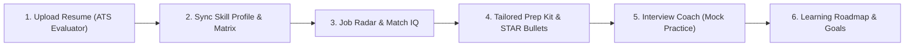

# 🚀 Saarthi AI — Official CTO Master User Guide & Sitemap
> **Author**: Bala Maneesh Ayanala (Founder & Chief Architect)  
> **Platform Version**: v2.1.0 (Career Operating System)  
> **Repository**: [https://github.com/Balama2520/SaarthiLink](https://github.com/Balama2520/SaarthiLink)  
> **Target Audience**: Candidates, Job Seekers, Recruiters, and Academic Partners

---

## 📌 Executive Summary & Architecture Overview

Welcome to **Saarthi AI** — an end-to-end, intelligence-driven **Career Operating System**.

Saarthi AI was built by Founder **Bala Maneesh Ayanala** to solve the fundamental fragmentation in career growth: static job portals, opaque ATS keyword matching, disjointed interview prep, and unguided learning plans.

Saarthi AI links every stage of your career journey together into one continuous feedback loop:

---

## 🧭 Page-by-Page Detailed User Guide

---

### 1. 🏠 Landing Page (`#/`)
* **Purpose**: High-level introduction to Saarthi AI, architecture preview, interactive demo workflows, and platform capability sitemap.
* **Key Components**:
  - Hero CTA: **"Launch App"** or **"Assess Your Resume"**.
  - Interactive Workflow Switcher: Preview Resume ATS, Job Match IQ, Interview Coach, and Roadmaps without logging in.
  - Architecture Badges: Saarthi AI Brain Model, Google Gemini LLM, and 14-Tab Google Sheets Job Catalog.
* **Step-by-Step Instructions**:
  1. Click **"Assess Your Profile"** or **"Get Started Free"**.
  2. Explore the live feature tabs to see sample output preview cards.
  3. Click **"Launch App"** at the top right to register or sign in.
* **CTO Pro-Tip**: Bookmark the landing page for quick access to deployment status and feature release updates.

---

### 2. 🔐 Auth & Security (`#/auth`)
* **Purpose**: Secure account creation, JWT authentication, and session management.
* **Key Components**:
  - **Login Tab**: Standard username/password entry.
  - **Register Tab**: Quick 1-click account creation with instant token issuance.
  - **Demo Account**: Instant 1-click guest login for testing features without creating a new password.
* **Step-by-Step Instructions**:
  1. Select **Register** if you are new, or **Login** if returning.
  2. Enter a username (min 3 chars) and password (min 6 chars).
  3. Or click **"Use Demo Account"** to bypass manual sign-up.
* **CTO Pro-Tip**: Sessions persist securely in local storage. If your session expires after 7 days, the app will automatically request a silent refresh token.

---

### 3. 📊 Dashboard & Career Control Center (`#/dashboard`)
* **Purpose**: Your central command hub showing ATS score trends, active job recommendations, active goals, and recent activity.
* **Key Components**:
  - **Metrics Overview Bar**: Overall ATS Score, Identified Tech Skills, Applied Jobs, and Active Roadmaps.
  - **Quick Action Bar**: Fast shortcuts to Upload Resume, Practice Interview, Search Jobs, and Create Roadmap.
  - **Top Recommended Roles Widget**: AI-ranked job openings matching your resume skills.
  - **Active Goal Progress**: Milestones and step completion breakdown.
* **Step-by-Step Instructions**:
  1. Start every session here to check your overall readiness score.
  2. Click any job card under **Recommended for You** to view full match details.
  3. Use the **Quick Actions** pill buttons to jump directly to specific tools.
* **CTO Pro-Tip**: As you upload updated resumes or complete mock interviews, your Dashboard metrics recalculate in real-time.

---

### 4. 🎯 Goals & Milestones (`#/goals`)
* **Purpose**: Structured goal tracker and AI decision engine for long-term career planning (e.g. "Land a Remote Software Engineer Job in 90 Days").
* **Key Components**:
  - **Create Goal Modal**: Title, target role, target deadline date, and priority level.
  - **AI Sub-task Generator**: Automatically breaks down large goals into actionable weekly milestones.
  - **Progress Tracker**: Visual percentage completion bar.
* **Step-by-Step Instructions**:
  1. Click **"+ Add New Goal"**.
  2. Enter your goal name (e.g. *"Become a Backend Engineer"*).
  3. Click **"Generate AI Milestones"** to let Saarthi populate a 4-week task list.
  4. Check off milestones as you complete them to increase your progress score.
* **CTO Pro-Tip**: Break large goals down into 2-week sprints for maximum momentum.

---

### 5. 🗂️ Workspaces (`#/workspaces`)
* **Purpose**: Group related career artifacts (resume drafts, notes, target jobs, interview questions) into isolated AI-aware project contexts.
* **Key Components**:
  - **Workspace Navigator**: Switch between target roles (e.g., *"Frontend Engineer Workspace"* vs *"Data Analyst Workspace"*).
  - **Context File Drawer**: Upload spreadsheets, job specifications, or notes.
  - **Dedicated Workspace Chat**: Ask AI questions with full context of that specific workspace.
* **Step-by-Step Instructions**:
  1. Click **"Create Workspace"** and name it after your target role or company (e.g. *"Google SWE Application"*).
  2. Upload target job descriptions or notes into the workspace drawer.
  3. Use the workspace chat to ask role-specific questions like *"Summarize key requirements across my 3 target job postings"*.
* **CTO Pro-Tip**: Create separate workspaces for each company tier (e.g., Tier 1 Tech, Startups, Higher Studies).

---

### 6. 📄 Resume ATS Evaluator (`#/resume`)
* **Purpose**: Upload PDF/DOCX/TXT resumes to extract skills, compute structural ATS scores, detect keyword gaps, and sync profile skills.
* **Key Components**:
  - **File Drag & Drop Area**: Accepts PDF, DOCX, and TXT files up to 5 MB.
  - **Target Role Selector**: Select or type your desired job title for tailored ATS scoring.
  - **Overall ATS Readiness Score Gauge**: 0–100 score breaking down structure, skills, education, and keyword density.
  - **Parsed Skill Chips**: Extracted tech & soft skills automatically categorized.
  - **Profile Sync Button**: 1-click button to save parsed skills into your global candidate profile.
* **Step-by-Step Instructions**:
  1. Drop your PDF resume into the upload zone.
  2. (Optional) Type your **Target Role** (e.g., *"Full Stack Developer"*).
  3. Click **"Analyze Resume"**.
  4. Review your ATS score breakdown, strengths, and weaknesses.
  5. Click **"Sync to My Profile"** to make these skills visible across the entire app.
* **CTO Pro-Tip**: Re-upload your resume after making recommended edits to see your score jump!

---

### 7. 💼 Job Finder & Opportunity Radar (`#/job-finder`)
* **Purpose**: Search verified job listings, run Job Match IQ evaluations, and generate 1-click Prep Kits (Cover Letter + Interview Questions + Roadmap).
* **Key Components**:
  - **Internal Radar**: Filter active opportunities by search query, location, experience level (Fresher, Mid-Level), and employment type.
  - **Check My Match (Job Match IQ)**: Paste any job description to get instant match percentage and missing technical skills.
  - **1-Click Prep Kit Generator**: Generates a complete tailored Cover Letter, 3 STAR Interview Questions, and a 3-step Study Focus list for any job card.
  - **Save & Apply Tracker**: Bookmark jobs to your **Saved** tab or click **Apply** to record your application event.
* **Step-by-Step Instructions**:
  1. Browse active jobs under **Internal Radar** or filter by role (e.g., *"Python"* or *"Remote"*).
  2. Click on a job card to open the detail modal.
  3. Click **"Generate Prep Kit"** to instantly generate a tailored cover letter and targeted interview questions.
  4. Or switch to **"Check My Match"**, paste a job description from LinkedIn/Glassdoor, and click **"Analyze Fit"**.
* **CTO Pro-Tip**: Copy the generated cover letter into your job application for a 3x higher callback rate!

---

### 8. 🎙️ Interview Coach (`#/interview`)
* **Purpose**: Practice mock interview questions with real-time feedback, STAR-format structuring, and audio speech recognition.
* **Key Components**:
  - **Role & Topic Selector**: Select Software Engineering, System Design, Behavioral (STAR), or HR Round.
  - **Live Question Cards**: Tailored interview prompts with recommended answer frameworks.
  - **Audio Speech Recorder**: Record your spoken response via browser microphone for clarity analysis.
  - **AI Answer Evaluator**: Gives score (0–100), key missed points, and model STAR response.
* **Step-by-Step Instructions**:
  1. Choose your category (e.g., *"Behavioral / STAR Method"*) and difficulty level.
  2. Click **"Start Practice Session"**.
  3. Type or record your spoken answer into the text area.
  4. Click **"Evaluate My Answer"** to receive instant feedback on structure, technical depth, and delivery.
* **CTO Pro-Tip**: Practice out loud using the microphone button to build confidence for real video interviews!

---

### 9. 🗺️ Learning Roadmaps (`#/roadmaps`)
* **Purpose**: Generate step-by-step career learning paths tailored to your current skill level and target role.
* **Key Components**:
  - **Pre-built Career Tracks**: Frontend, Backend, AI/ML, DevOps, Data Science, and Cloud Architecture.
  - **Custom AI Roadmap Generator**: Enter any target job title to generate a 4-stage learning path.
  - **Interactive Module Checkboxes**: Track topics completed step-by-step.
* **Step-by-Step Instructions**:
  1. Select a pre-built track or type a custom role (e.g. *"DevOps & Kubernetes Engineer"*).
  2. Click **"Generate Personalized Roadmap"**.
  3. Review the 4 stages (Foundations → Core Skills → Advanced Concepts → Portfolio Projects).
  4. Check off modules as you learn them.
* **CTO Pro-Tip**: Link your roadmap milestones directly to your **Goals** tab for unified tracking.

---

### 10. 🎓 Graduate Hub & Higher Studies (`#/grad-hub`)
* **Purpose**: Guidance for students planning MS/MTech higher studies, GRE/TOEFL prep, university selection, and Statement of Purpose (SOP) drafting.
* **Key Components**:
  - **University Matcher**: Filter universities by GRE score, budget, and field of study.
  - **SOP Assistant**: Draft and polish Statement of Purpose essays using AI.
  - **LOR Template Library**: Ready-to-use Letter of Recommendation drafts.
* **Step-by-Step Instructions**:
  1. Select your target degree (MS in CS, Data Science, MBA).
  2. Input your GPA / GRE targets.
  3. Use the **SOP Assistant** tab to input your background and receive a structured 5-paragraph SOP draft.
* **CTO Pro-Tip**: Customizing your SOP for each university's specific research labs increases admission chances significantly.

---

### 11. 📈 Growth Lab & Skill Matrix (`#/growth-lab`)
* **Purpose**: Visualize your technical skill matrix, identify market demand gaps, and track skill proficiency over time.
* **Key Components**:
  - **Skill Proficiency Radar**: Visual radar chart of your top technical skills.
  - **Market Demand Benchmarks**: Compares your skills against live job market demand.
  - **Recommended Skill Upgrades**: Suggests high-value skills to learn next (e.g., adding Docker or System Design).
* **Step-by-Step Instructions**:
  1. View your automatically synced skills from your uploaded resume.
  2. Rate your proficiency levels (Beginner, Intermediate, Advanced).
  3. Check the **High Demand Gaps** section to see what top employers are seeking.
* **CTO Pro-Tip**: Keep at least 3 skills marked as "Advanced" to rank higher in recruiter discovery searches.

---

### 12. 🧰 Career Toolkit (`#/toolkit`)
* **Purpose**: Suite of specialized career utility tools: STAR Bullet Generator, Keyword Optimizer, Cold Email Outreach Writer, and Salary Estimator.
* **Key Components**:
  - **STAR Bullet Rewriter**: Turn weak resume bullets (*"worked on APIs"*) into high-impact metrics-driven bullets (*"Architected 12 FastAPI REST endpoints handling 50k req/min"*).
  - **Cold Outreach Writer**: Draft professional messages to recruiters and engineering managers on LinkedIn.
  - **Salary Range Estimator**: View benchmark salary ranges by role and location.
* **Step-by-Step Instructions**:
  1. Select the tool tab you need (e.g. **STAR Bullet Generator**).
  2. Paste your raw bullet point and select your domain.
  3. Click **"Transform into STAR Format"**.
  4. Copy the improved bullets directly into your resume.
* **CTO Pro-Tip**: Always include quantifiable numbers (percentages, latency improvements, user counts) in your resume bullets!

---

### 13. 🤖 Chat Coach / Concierge Bot (`#/chat`)
* **Purpose**: Interactive 24/7 AI career mentor for quick answers, resume advice, coding questions, and career strategy.
* **Key Components**:
  - **Personality Selector**: Switch persona between *Default*, *Career Copilot*, *Interview Prep*, and *Learning Mentor*.
  - **Quick Prompt Cards**: 1-click prompts like *"How do I explain a gap year?"* or *"Review my Python projects"*.
  - **Streaming AI Response**: Instant progressive response streaming.
* **Step-by-Step Instructions**:
  1. Select your desired persona or leave on **Career Copilot**.
  2. Click a quick prompt card or type your specific question in the message box.
  3. Press Enter to stream real-time advice.
* **CTO Pro-Tip**: You can activate the floating **Saarthi Guide Bot** icon at the bottom right of any page for instant assistance anywhere in the app!

---

### 14. 🔍 Discover & Recruiter Hiring Portal (`#/discover`)
* **Purpose**: Discovery feed for candidates to find trending roles, and a submission portal for recruiters/founders to post active job openings.
* **Key Components**:
  - **Step 1: Role Radar**: Public feed of curated openings.
  - **Step 4: Hiring Portal (For Recruiters & Founders)**: Public job posting form to submit verified job listings into the Saarthi ingestion pipeline.
* **Step-by-Step Instructions**:
  - **For Job Seekers**: Scroll through curated company cards and click **"Apply Direct"**.
  - **For Recruiters/Founders**: Click **"Post a Job Opening"**, fill out title, company, location, salary range, and apply URL, then click **"Submit Opening"**.
* **CTO Pro-Tip**: Submitted jobs pass through automated deduplication before appearing in the primary job catalog.

---

### 15. 🛡️ Admin Control Center (`#/admin`)
* **Purpose**: Restricted admin dashboard for system monitoring, user management, and Google Sheets Job Seeding Control.
* **Key Components**:
  - **System Health Monitor**: Live latency metrics for API services, database, and Saarthi AI Brain.
  - **Google Sheets 14-Tab Control Center**: Monitor 01_SOURCES, 09_JOBS_STAGING, 11_SYNC_LOGS, and 13_DASHBOARD tabs.
  - **Run Pipeline Button**: Trigger manual seeding pipeline syncs.
* **Step-by-Step Instructions**:
  1. Access requires admin credentials (configured via `ADMIN_USERNAMES` in environment).
  2. View system telemetry and job ingestion stats.
  3. Click **"Run Seeding Pipeline"** to pull staging jobs into the database.
* **CTO Pro-Tip**: Check 12_SOURCE_ERRORS in Google Sheets if job sources fail to fetch.

---

### 16. ℹ️ About Page (`#/about`)
* **Purpose**: Product architecture documentation, tech stack breakdown, and leadership background.
* **Key Components**:
  - **Founder Showcase**: Highlights **Bala Maneesh Ayanala** (Founder & Chief Architect).
  - **Production Tech Stack Grid**: Overview of Python 3.14 / FastAPI, SQLAlchemy, Hugging Face, Gemini, and React/TS.
* **Step-by-Step Instructions**:
  1. Read through the architecture blocks to understand how Saarthi processes job listings and resume data securely.

---

### 17. 📩 Contact Page (`#/contact`)
* **Purpose**: Contact form for feedback, bug reports, recruiter partnerships, and technical inquiries.
* **Key Components**:
  - **Direct Inquiry Form**: Send messages directly to `saarthi.ai.team@gmail.com`.
  - **Persona Selector**: Student, Job Seeker, Recruiter, HR Manager, or Founder.
  - **Official Credentials**: Links to official GitHub repository (`https://github.com/Balama2520/SaarthiLink`) and `Saarthi AI Brain` model status.
  - **FAQ Accordion**: Instant answers to common questions.
* **Step-by-Step Instructions**:
  1. Fill out your Name, Email, Persona, and Message.
  2. Click **"Dispatch Message to Saarthi Team"**.
* **CTO Pro-Tip**: For technical issues, include your browser OS and the page URL you were on.

---

## ⚡ CTO Summary Checklist: Recommended Workflow for New Users

1. **Step 1**: Register or use 1-Click Demo Login (`#/auth`).
2. **Step 2**: Upload your PDF/DOCX resume on the **Resume ATS** page (`#/resume`).
3. **Step 3**: Click **"Sync to My Profile"** to populate your technical skill matrix.
4. **Step 4**: Go to **Job Finder** (`#/job-finder`) to browse roles matching your skills.
5. **Step 5**: Click **"Generate Prep Kit"** on any job card to get a custom cover letter and interview questions.
6. **Step 6**: Practice your responses on the **Interview Coach** (`#/interview`).
7. **Step 7**: Set your 30-day target on the **Goals** page (`#/goals`).

---
*Saarthi AI Architecture & User Guide maintained by Bala Maneesh Ayanala (Founder & Chief Architect).*
